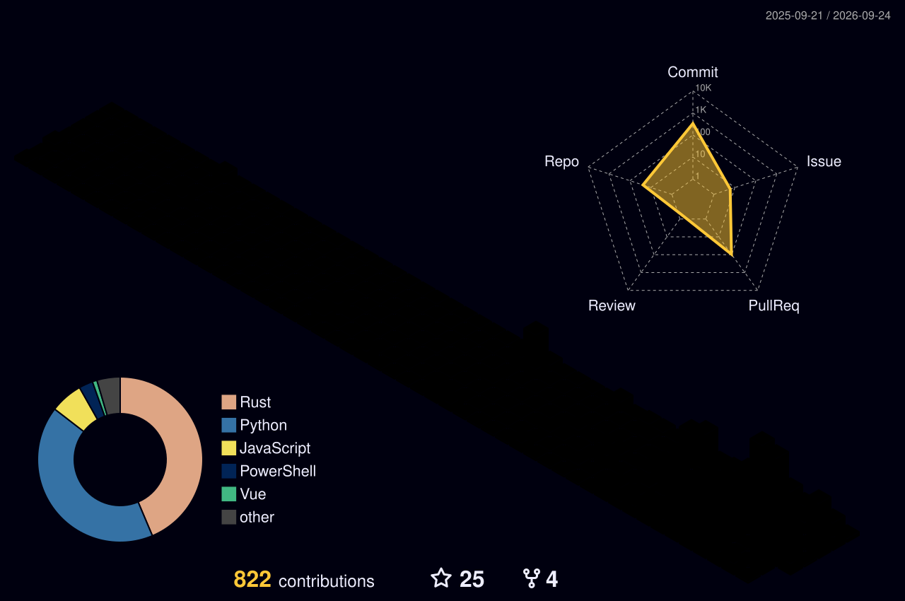

<!-- 徽章群 -->

<!-- 访问计数 -->

## 📊 GitHub 数据

<!-- 连续贡献 -->

<!-- 3D 贡献图：夜间彩虹主题，每日自动更新 -->

## 🎶 最近活跃

<!-- GitHub 活动图 -->

---

<!-- 页脚 -->

**感谢造访我的小窝 ~**  
⭐ 如果我的项目帮到了你，记得给颗星星哦！这会让我开心一整天！

*Made with 💗 by Matsuko_A*

